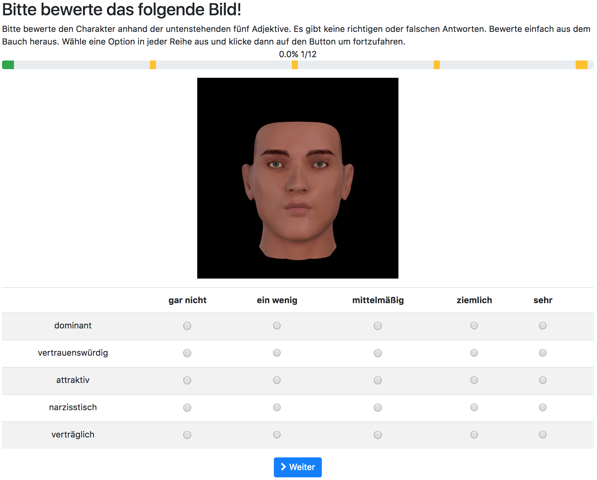

# DeEvA

This is a platform for the procedural generation of characters from personality traits.

## Projects

DeEvA consists of several inter-dependent projects.

| I am text to the left  | Test |

* Character Generation: Consists of a set of scripts to procedurally generate virtual characters. It also allows for the generation of pictures of them. It uses the [ManuelBastioniLAB](http://www.manuelbastioni.com/) add-on.

  | Blender GUI | Masked Face |
  | - | - |
  |  |  |

* Voting Platform: Is a web-based platform (using [DJango](https://www.djangoproject.com/)) conceived to run psychological experiments where users vote on the pictures of virtual characters. The collected data is used as input for the Character Generator.

  

* MBLab-FalseTimePatch: It is a patch for the ManuelBastioniLAB allowing for the generation of characters via scripting. It is used by the CharacterGeneration project.

## Documentation

Please, thee the [DeEvA Wiki](https://github.com/fnunnari/deeva/wiki) for up-to-date documentation.

## People

* [Fabrizio Nunnari](http://www.dfki.de/~fanu01/) - Concept, Blender add-on Develpment.
* Alexis Heloir - Concept.
* Nicholas Erbach - Django and Blender add-on development.
* Anke Hirsch - User Studies.
