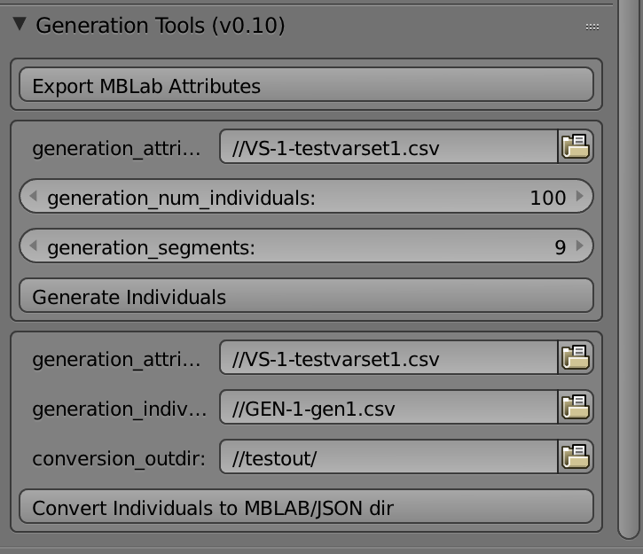
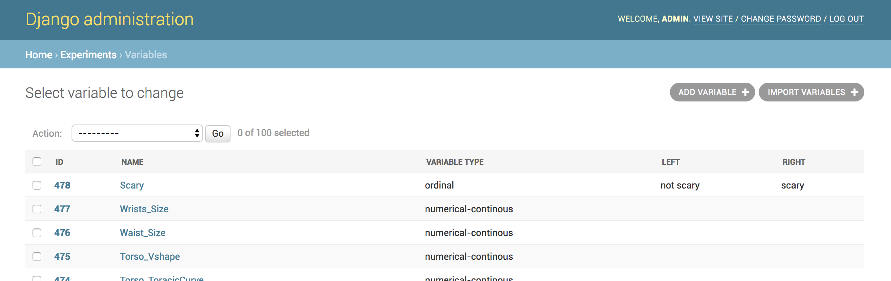
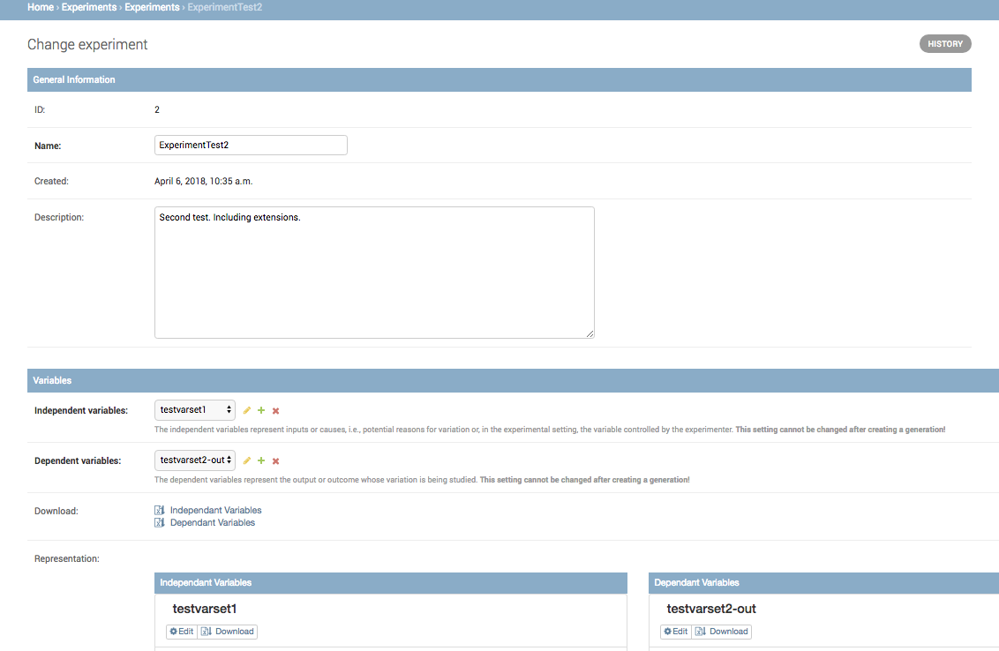
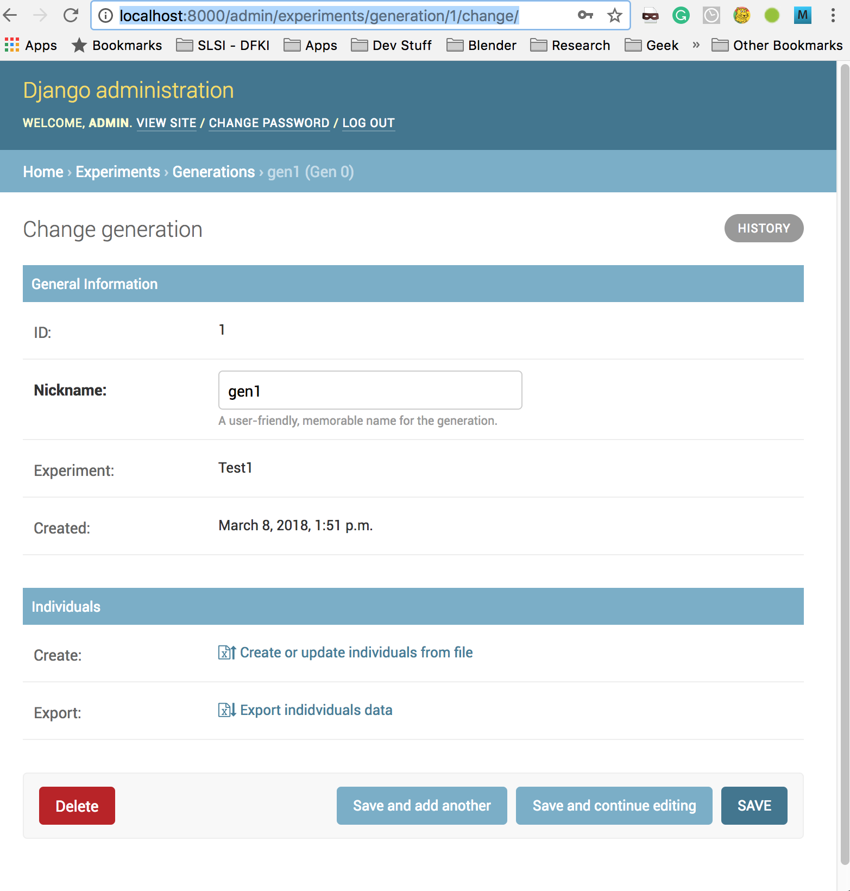
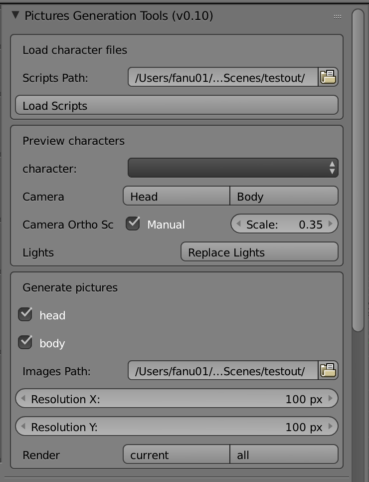
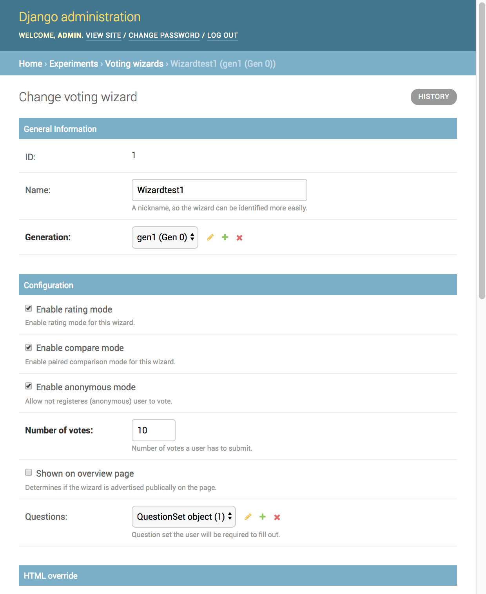
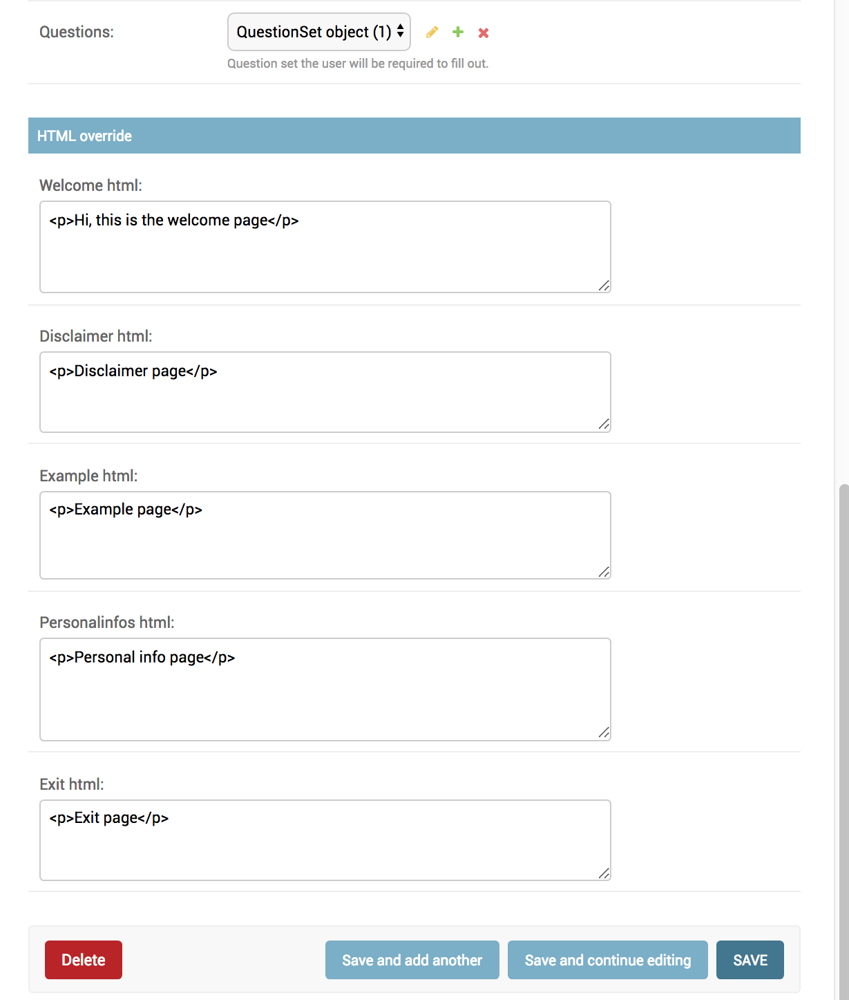

# First time setup

This step requires using the CharacterGeneration project.

* Create an MBLab character and select its mesh.
* Export the MBLab variables from Blender.
  * Generation Tools Panel: click `Export MBLab Attributes`
  * E.g.: `mblab_attributes-1_6_1.csv`.

  

* Import the variables from Blender/MBLab.
  * Go to http://localhost:8000/admin/experiments/variable/
  * Click on `Import Variables +`

  

# Create a new experiment

## Create two variable set

## Add variables to the set
It means adding entries in the variable range table.

## Add variables set to the experiment

## Create the questions

# Create individuals for the experiment

This step requires using the CharacterGeneration project.

* Voting Platform: Download the independent (physical attributes) variable set.
  - It creates a csv with variable ID, name, min, max, ...?
  - E.g.: `VS-1-testvarset1.csv`
  

* Character Generator: Use the generation subpanel to create a table of individuals.
  - Select the variables/attributes table.
  - Insert the number of individuals to create.
  - Insert the number of segments for the randomization. Useful to avoid very close values.
  - Values will be random in the provided range for each variable.
  - Click the `Generate Individuals` button.
    - It creates a CSV file with each line: empty ID, for each attribute the value.
    - This is the format needed by the voting platform to import the individuals.
* Voting Platform: Upload the generated individuals table in the Voting platform as Generation.
  - e.g. `http://localhost:8000/admin/experiments/generation/1/change/`: Create: Create or update individuals from file.
  

* Voting Platform: Re-download the generation to have IDs.
  - Export: `Export Individuals Data`
  - e.g. `GEN-1-gen1.csv`
* Character Generator: Convert the CSV in the json files needed to generate the pictures.
  - Select the variables table CVS files
  - Select the freshly crated individuals file.
  - Select an output directory
  - Click `Convert individuals to MBLAB/JSON dir` to MBLAB/JSON dir.
  - This will fill a directory with JSON files, one for each individual.

## Create the pictures of the Individuals

* Select the directory where you save your individuals' JSON files.
* Click `Load Scripts` button.
* Choose to save either head and/or body picture.
* Select the output path
* Select the resolution
* Render either the currently selected character or all of them.

## Upload the Pictures
IMPL. IN PROGRESS

# Create a Wizard

A Wizard describes the set of pages and the settings for voting.

A Wizard is a sequence of web pages:
* Welcome
* disclaimer
* instructions
* example
* a sequence of pages to express the vote: normally much more than 1.
* a Questions page to gather information about the voter
* a goodbye page

Each page can be configured independently using HTM code.

Each Wizard is associated to a generation. During the vote, the individuals to vote will be taken from the selected generation.

Voting can be performed in two modes: Rating and Paired Comparison.
A Voting page:
* in Rating mode, only one individual is shown and the voter must select a value for each independent variable of the experiment using a scale.
* in Paired comparison mode, two individuals are shown next to the other and the voter must express a preference for one of the two.

If the anonymous mode is checked, users can vote without logging in the Django platform.
