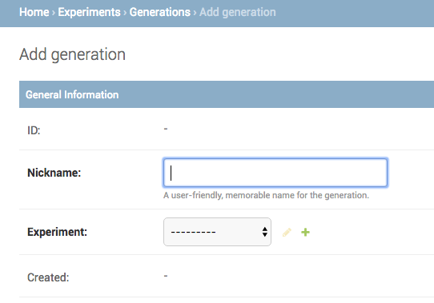
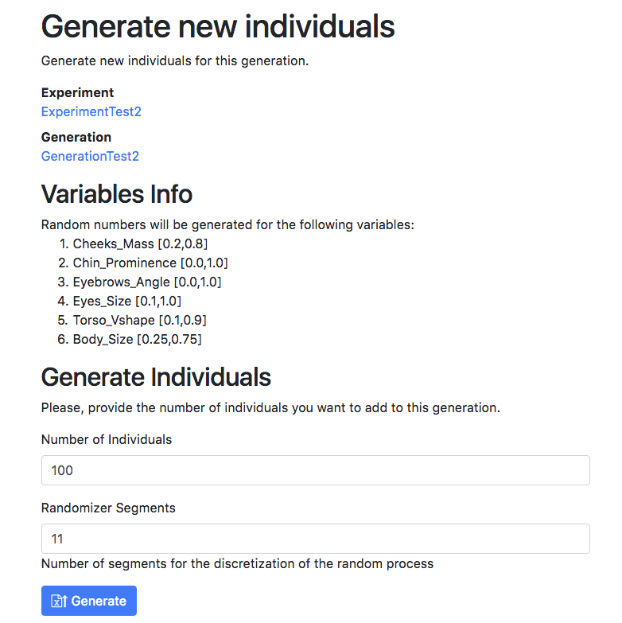

# Setting up an Experiment

This document explains how to create a new experiment for the [DeEvA](https://github.com/fnunnari/deeva) Voting Platform.
Although this document is stored in the [Voting Platform](https://github.com/fnunnari/deeva/tree/master/VotingPlatform),
 the creation process requires also the use of the [Character Generation](https://github.com/fnunnari/deeva/tree/master/CharacterGeneration) Blender plugin,
 mainly for the generation of the images.  

## First time setup

This step requires using the CharacterGeneration project.
In this step you export into a file the list of physical attributes that you can use to modulate the shape of your character. 
You will then import this file into the Voting Platform.

* Create an MBLab character and select its mesh.
* Export the MBLab variables from Blender.
  * On the Generation Tools Panel: click `Export MBLab Attributes`
  * Export as, e.g.: `mblab_attributes-1_6_1.csv`.

    

* Import the variables from Blender/MBLab.
  * Go to http://localhost:8000/admin/experiments/variable/
  * Click on `Import Variables +`

    

## Creating a new experiment

A new experiment can be created using the configuration page: `/admin/experiments/experiment/` and clicking on `ADD EXPERIMENT +`

## Create two variable set

You need a variable set for _independent_ variables and one for _dependent_ variables:

* The independent variables represent inputs or causes, i.e., potential reasons for variation or, in the experimental setting, the variable controlled by the experimenter.
* The dependent variables represent the output or outcome whose variation is being studied. The measured variables.

### Add variables to the set

It means adding entries in the variable range table.

TODO: Explain variable configuration panel in a set: min, max, and labels.

If a variable is not defined yet, you can create a new one.

TODO: explain variables creation panel elements and how they are used: name, type, left/right-(description)

### Content names

Configure what is going to be shown to the subjects of this experiment.
It can be a list of images, sound, movies, or HTML pages.

The name is for your use. The content type is by extension.

In the field **Content names** you provide a comma-separated list of identifiers and type in the form identifier.type.

As an example, for an experiment where you want to show the face and the head of a character, you will input

```txt
head.png,body.png
```

Then, you will have to provide the content to your generations with images with name format `00001-head.png,00002-head.png, 00002-head.png, 00002-body.png, ...`.
The number of leading zeroes is not influent; that's only for your convenience to keep files in alphabetical order.

### Add variables set to the experiment

TODO

### Create the questions

TODO

## Create a Generation and the individuals for the experiment

* Create a new Generation: `http://localhost:8000/admin/experiments/generation/add/`
  * Set the name and the corresponding experiment.
  * `Save and continue editing`

    

* Go to the generation administration page, e.g.: `http://localhost:8000/admin/experiments/generation/2/change/`

  

* Click on `Generate Individuals`
  * You will see the list of variables used by the experiment.
  * Enter how many individuals you wan to create in `Number of Individuals`.
  * Enter how many segments you want to discretize the randomization.
    For example, for a variable ranging form 0.0 to 1.0, 11 segments will lead to 11 possible values between 0.0, 0.1, 0.2, ..., 0.9, 1.0. This avoid the creation of different  idividuals with very similar values.
  

## Create the pictures of the Individuals

In four steps.

1. Voting Platform: download the list of physical attributes.
    * Click `Download: Independent Variables`
    * They are the physical attributes.
    * It creates a csv with header: `variable ID, name, min, max, ...`
    * E.g.: `VS-1-testvarset1.csv`

    

2. Voting Platform: Go to the experiment page and download the list of individuals in the generation.
    * Click `Export: Export individuals data`
    * e.g. `GEN-1-gen1.csv`

3. Character Generator: Convert the CSV in the json files needed to generate the pictures.
    * Select the variables table CVS file;
    * Select the individuals CSV file.
    * Select an output directory
    * Click `Convert individuals to MBLAB/JSON dir` to MBLAB/JSON dir.
    * This will fill a directory with JSON files, one for each individual.

4. Character Generator: Create the pictures
    * Select the directory where you save your individuals' JSON files.
    * Click `Load Scripts` button.
    * Choose to save either head and/or body picture.
    * Select the output path
    * Select the resolution
    * Render either the currently selected character or all of them.

    

5. Voting Platform: Upload the Pictures
    TODO

## Create a Wizard

A Wizard describes the set of pages and the settings for voting.


A Wizard is a sequence of web pages:

* Welcome
* disclaimer
* instructions
* example
* a sequence of pages to express the vote: normally much more than 1.
* a Questions page to gather information about the voter
* a goodbye page

Each page can be configured independently using HTM code.


Each Wizard is associated to a generation. During the vote, the individuals to vote will be taken from the selected generation.

Voting can be performed in two modes: Rating and Paired Comparison.
A Voting page:

* in Rating mode, only one individual is shown and the voter must select a value for each independent variable of the experiment using a scale.
* in Paired comparison mode, two individuals are shown next to the other and the voter must express a preference for one of the two.

If the anonymous mode is checked, users can vote without logging in the Django platform.
